# 安装cuda

1. 首先在Nvidia官网下载适合自己机器的CUDA版本，[官网下载](https://developer.nvidia.com/CUDA-TOOLKIT-ARCHIVE)，使用 **runfile** 的方式安装

**！！关键是匹配驱动、python和深度学习环境**

例如：cuda10.0+python3.8+tensorflow2.3.0或cuda11.0+python3.8+tensorflow2.4.0

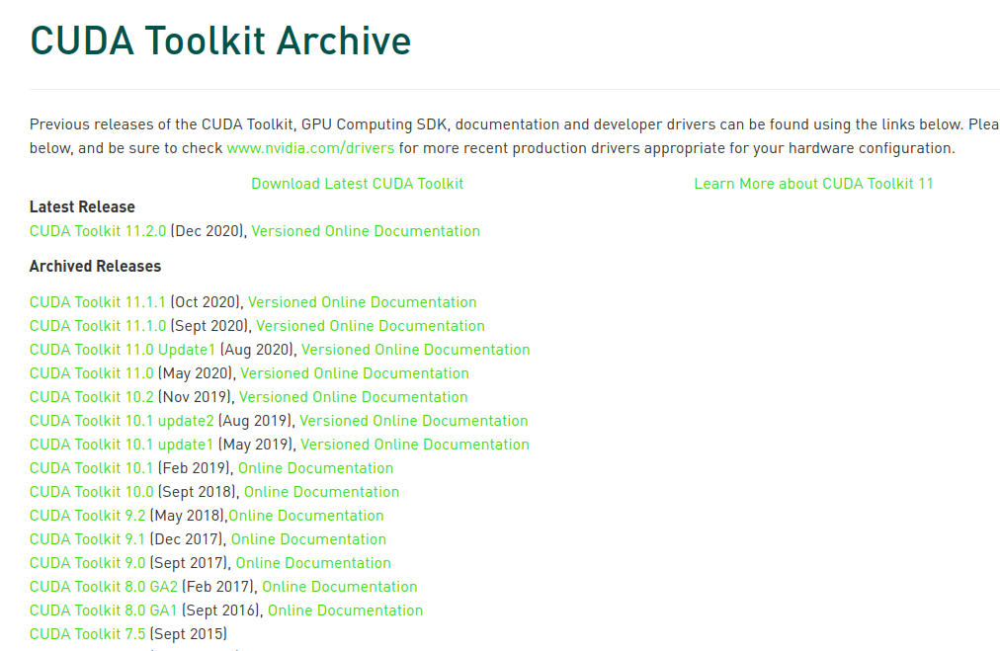

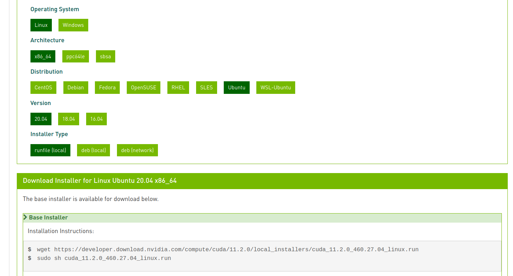

**可以直接将网址复制到浏览器，下载快点**

2. 如果电脑没有安装Nvidia显卡驱动，安装会顺利进行；若已经安装了Nvidia驱动，会提醒移除

   可以选择Abort退出，之后去删除驱动，也可以直接继续Continue，我选择Continue

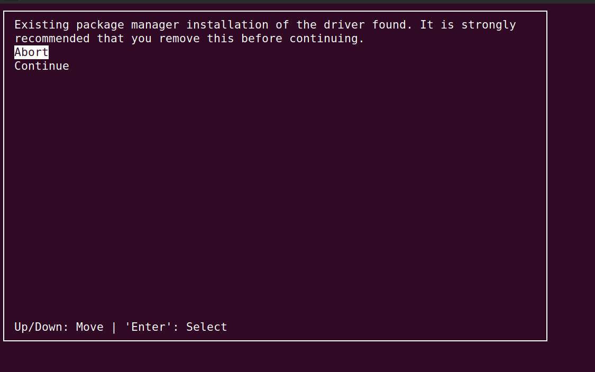

选择accpet接受协议

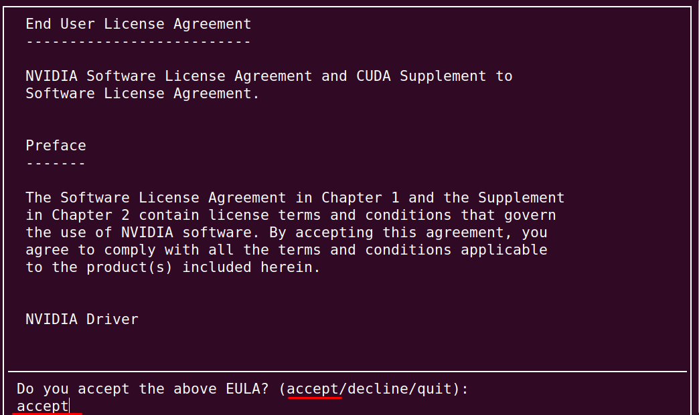

取消勾选第一个driver，直接回车就能取消前面的[X]，然后install

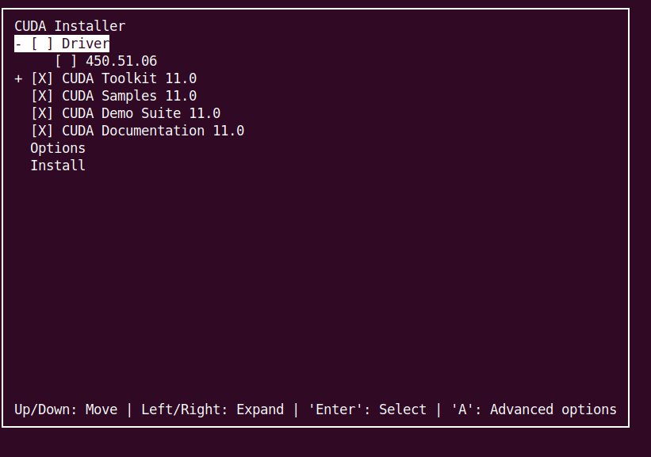

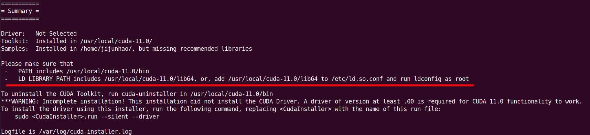

3. 根据提示的信息，配置环境变量

```shell
sudo vi ~/.bashrc   
```

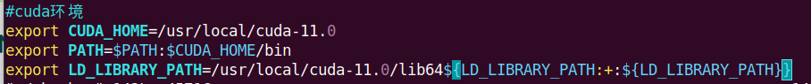

然后刷新环境变量

```shell
source ~/.bashrc 
```

4. 测试CUDA是否安装成功

```shell
nvcc -V
```

显示下图，说明成功

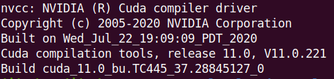


# 安装cudnn

1. 安装cuDNN ，[官网下载](https://developer.nvidia.com/rdp/cudnn-download?spm=a2c4e.10696291.0.0.1df819a4HJWSTe)（未注册的话，注册一个账号即可）

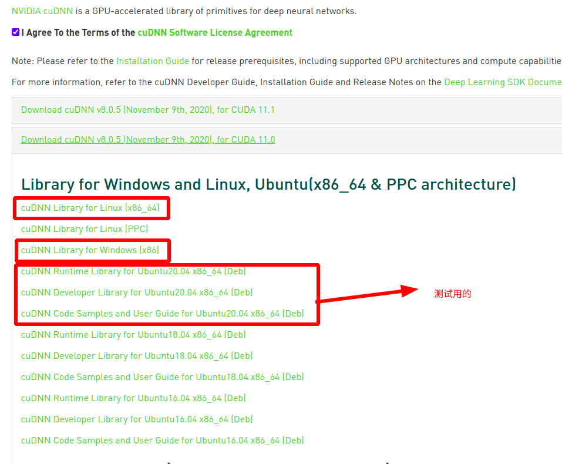

2. 解压复制到cuda路径下

```shell
tar -zxvf cudnn*
sudo cp cuda/include/cudnn.h /usr/local/cuda/include
sudo cp cuda/lib64/libcudnn* /usr/local/cuda/lib64
sudo chmod a+r /usr/local/cuda/include/cudnn.h /usr/local/cuda/lib64/libcudnn* 
```

3. 安装deb

```shell
sudo dpkg -i libcudnn8_8.0.5.39-1+cuda11.0_amd64.deb

sudo dpkg -i libcudnn8-dev_8.0.5.39-1+cuda11.0_amd64.deb 

sudo dpkg -i libcudnn8-samples_8.0.5.39-1+cuda11.0_amd64.deb
```
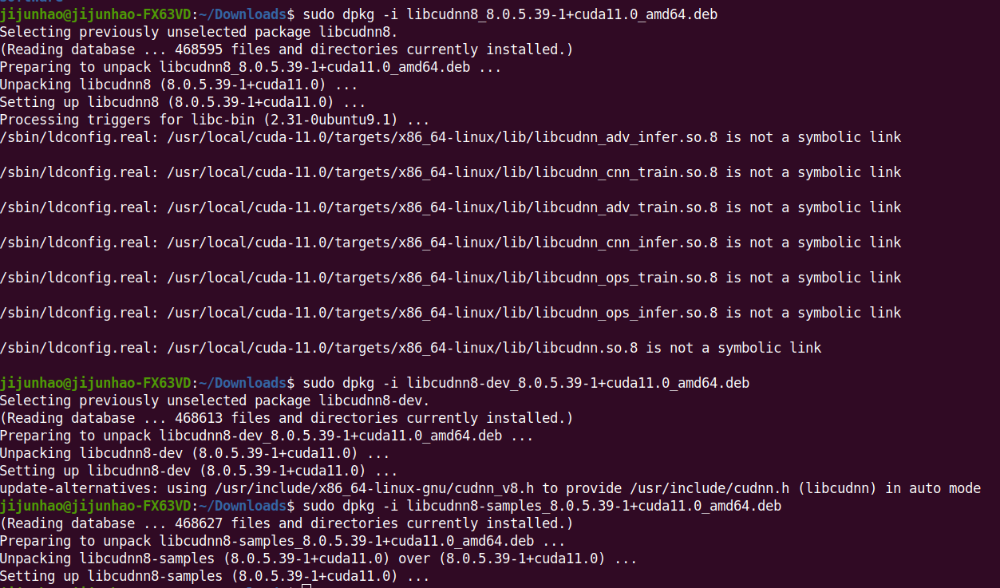


4. 测试

```shell
cd /usr/local/cuda/samples/1_Utilities/deviceQuery 
sudo make 
./deviceQuery 
```

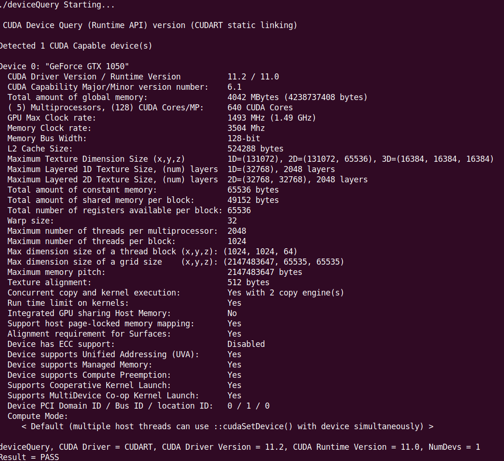

结果为PASS就成功了。

```shell
sudo make clean  #洁癖患者请清除编译
```

