## 安装环境

+ 工具：VMware Workstation 16 Pro

+ 系统配置要求：18.04 LTS 和server版本都行（20.04的python3.8导致一直报错）

+ 内存空间：2G，2核，50G

+ 网络模式：采用NAT模式网络

+ 处理器开启虚拟化引擎（三个可选）

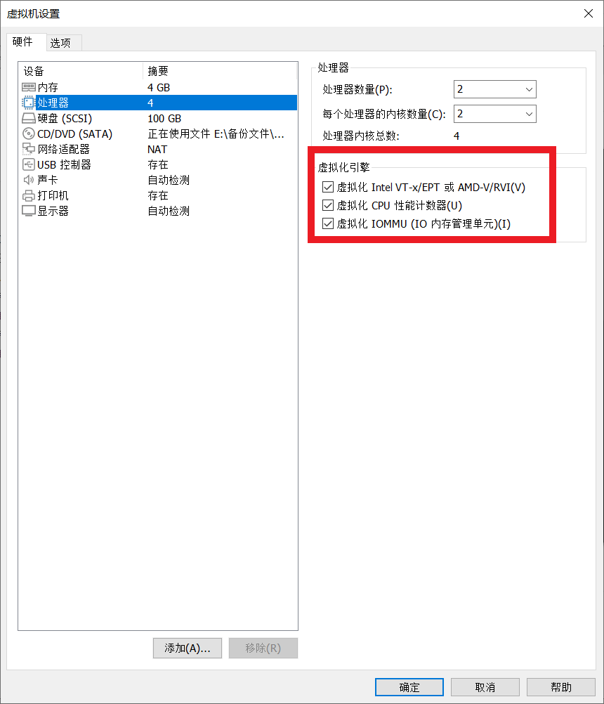

## 网络虚拟化

在VMware下，编辑------》虚拟网络编辑器，配置一些设置

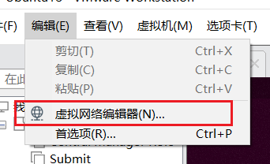

点更改设置

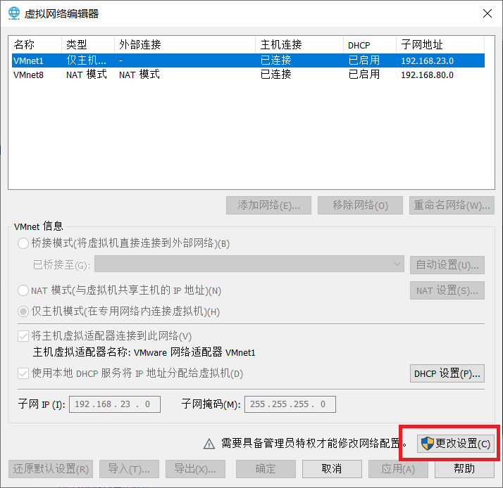

在VMnet8下，点NAT设置

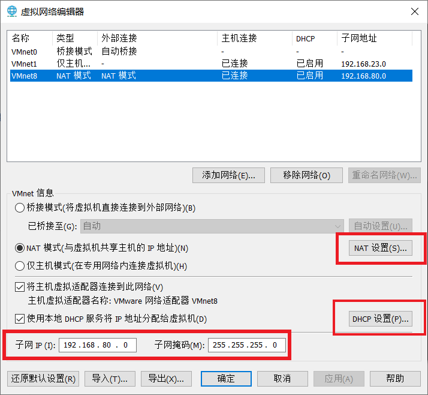

查看网关等信息

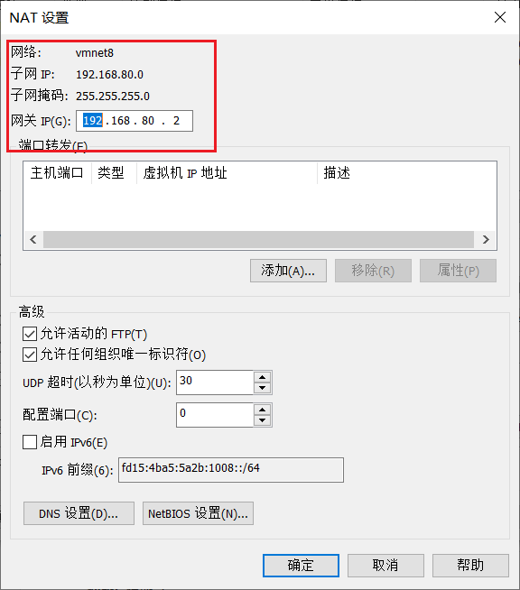

点DHCP设置，ip池起止点

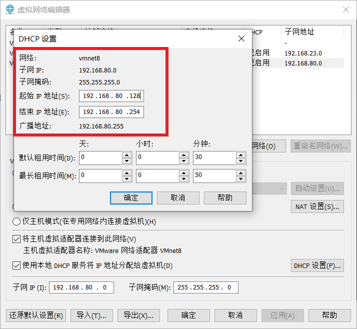

## 安装OpenStack

改阿里云的源，在系统设置Software & Update里面手动该也行

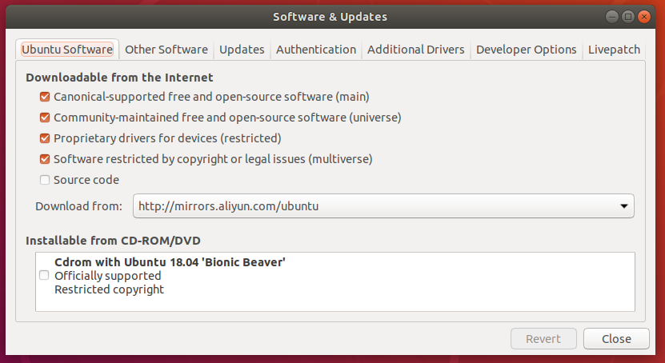

点close，等载入完成


更新

```shell
sudo apt update

sudo apt upgrade

sudo apt insall vim git python-pip
```

注意这里是python-pip 不要用python3-pip，20安装不成功就在python版本问题


1. 修改静态ip

```shell
cd /etc/netplan
vi 里面的那个文件
```


主机IP地址192.168.80.132（用ip a或者ifconfig查看ens33那个），子网掩码255.255.255.0，网关设置为192.168.80.2（VMnet8的子网地址里面看），DNS1:114.114.114.114，DNS2:8.8.8.8

不同的人只要该address和gateway4


```shell
# 
network:
    ethernets:
        ens33:
            dhcp4: no
            addresses: [192.168.80.132/24]
            optional: true
            gateway4: 192.168.80.2
            nameservers:
                    addresses: [114.114.114.114,8.8.8.8]
 
    version: 2
```

保存:wq

```she
sudo netplan apply
```

```shell
ip a
```

看看ip后面是不是加了24

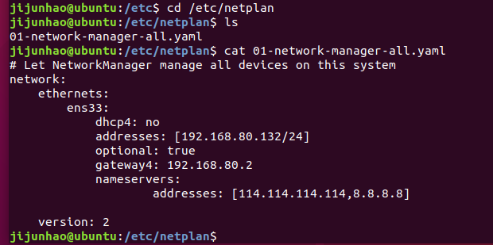

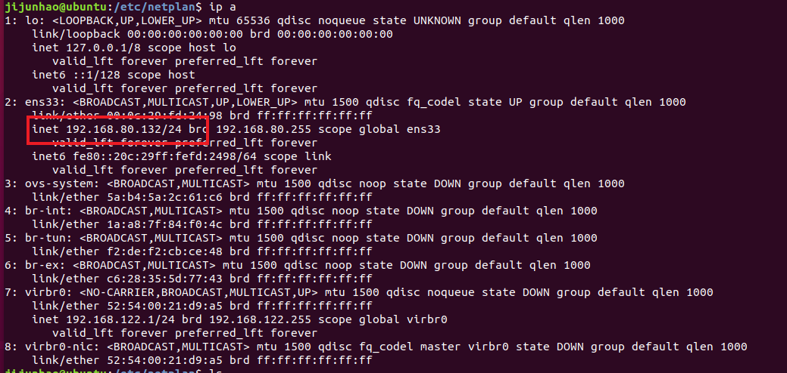

2. 更改主机映射

```shell
cat /etc/hostname
vi /etc/hosts
```

删掉127.0.0.1 localhost那一行(openstack会识别这玩意儿)

更改下一行为ip地址 hostname

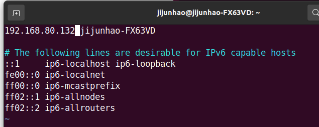

3. 关防火墙，开ssh

 ```shell
sudo ufw disable
 ```

```shell
cd ~
```

```shell
ssh-keygen -t rsa
```

几次回车就行

测试一下自己的ip22端口是否开启了

```shell
telnet 192.168.80.132 22
```

如果没有connect refuse应该成功了

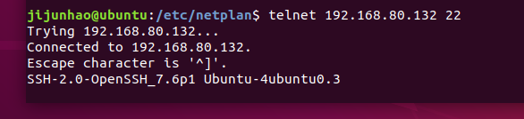

是否开启ssh的端口意义不大，主要防止有些github是需要22端口的


4. 时间同步

```
sudo dpkg-reconfigure tzdata
选择Asia -> 在选择Shanghai -> OK
```

```shell
sudo apt-get install ntpdate
sudo ntpdate cn.pool.ntp.org
date
```


5. 下载包

```
cd ~
```

```shell
sudo git clone https://gitee.com/jijunhao/devstack.git
```

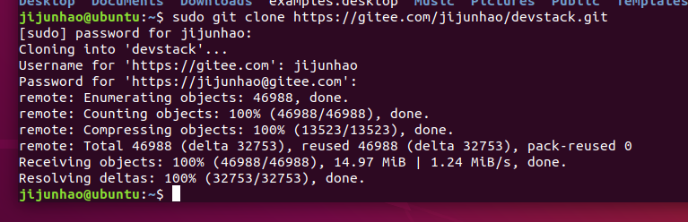

6. 创建账号

```shell
cd devstack/tools
sudo ./create-stack-user.sh
cd ../../
sudo mv devstack /opt/stack
sudo chown -R stack:stack /opt/stack/devstack

echo "stack ALL=(ALL) NOPASSWD: ALL" | sudo tee /etc/sudoers.d/stack

sudo su - stack     # 接下来的操作都在stack下进行
```

7. 修改pip的源（最好在原用户的~下也配置一下）

```shell
mkdir ~/.pip
vim ~/.pip/pip.conf
插入内容为：
[global]
index-url = http://mirrors.aliyun.com/pypi/simple/
[install]
trusted-host=mirrors.aliyun.com
```

8. 授权stack文件

```shell
sudo chmod -R 777 /opt/stack
```


9. 改配置文件

```shell
cd devstack
cp ./samples/local.conf ./
vi local.conf
```

```
[[local|localrc]]
# Define images to be automatically downloaded during the DevStack built process.
DOWNLOAD_DEFAULT_IMAGES=False
IMAGE_URLS="http://download.cirros-cloud.net/0.3.4/cirros-0.3.4-x86_64-disk.img"

# use TryStack git mirror
GIT_BASE=http://git.trystack.cn
NOVNC_REPO=http://git.trystack.cn/kanaka/noVNC.git
SPICE_REPO=http://git.trystack.cn/git/spice/sice-html5.git


# Credentials
DATABASE_PASSWORD=admin
ADMIN_PASSWORD=admin
SERVICE_PASSWORD=admin
SERVICE_TOKEN=admin
RABBIT_PASSWORD=admin
#FLAT_INTERFACE=enp0s3

HOST_IP="192.168.80.132"
NEUTRON_CREATE_INITIAL_NETWORKS=False
```

注意改掉自己的ip

10. 安装

```shell
./stack.sh
```


##  **错误注意事项**

+ 如果出现下载配置前的错误

```shell
./unstack.sh

./clean.sh

./stack.sh
```

以下是某些下载时候的图片

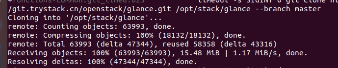

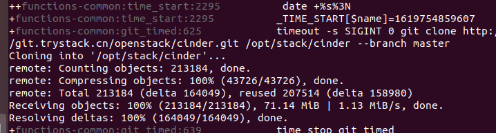

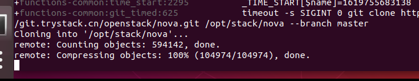

+ 如果出现配置错误

```shell
./unstack.sh

./stack.sh
```

不要./clean.sh，只需要重新一次./unstack.sh，问题就会好了，可能会出现的问题是数据库拒绝访问等配置错误


## 错误总结

1. pip无法卸载某些文件，例如

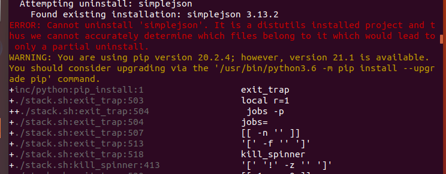

```shell
pip show simplejson
或者
pip3 show simplejson
```

找到文件的目标路径，手动卸载，一般都是*info文件

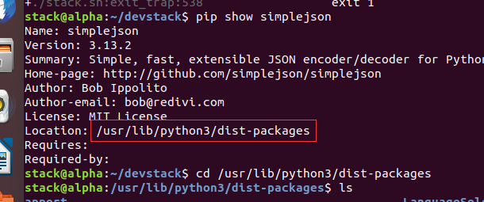

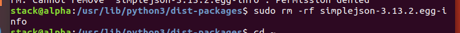

2. /.cache/pip权限拒绝读取写入错误

```shell
sudo chmod -R 777 /opt
./stack.sh
```