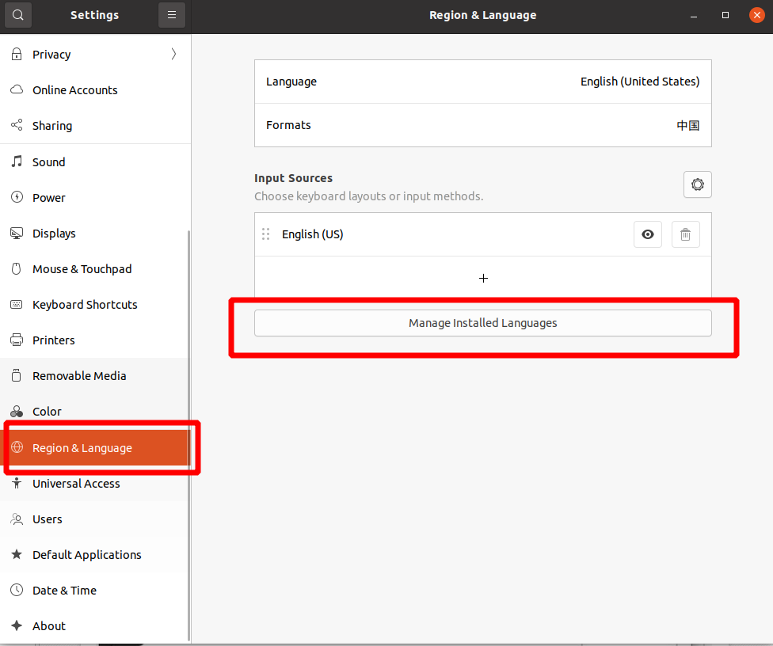
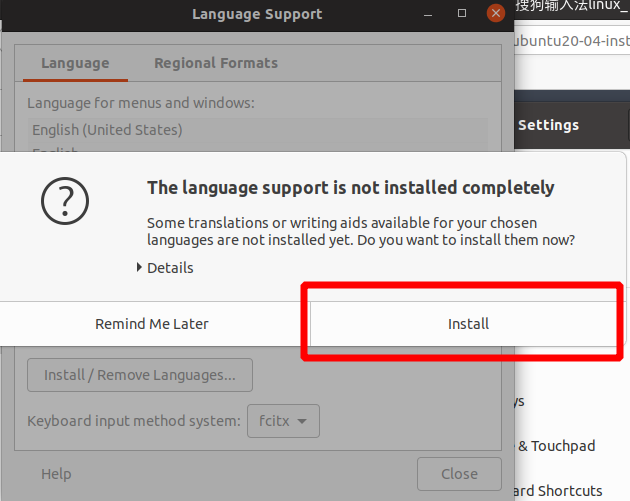
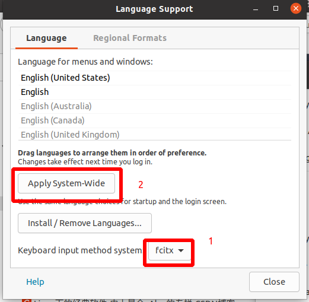
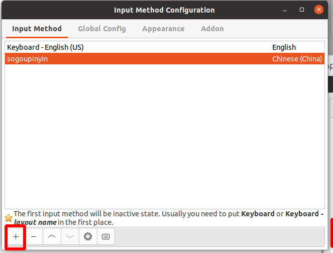
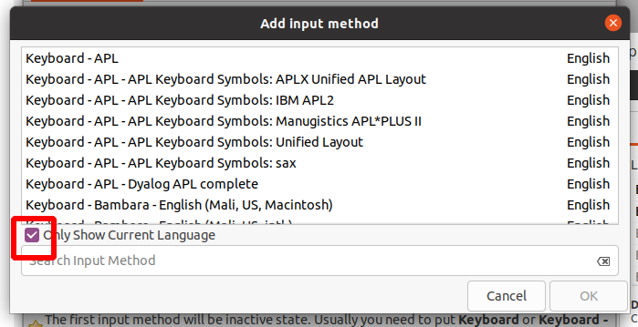
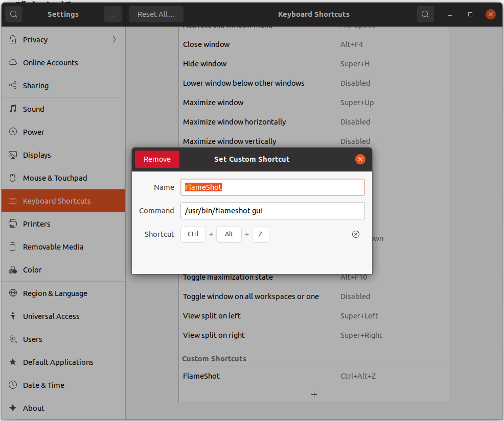

# ubuntu下安装常用软件

换源，建议清华源，参考win+ubuntu安装手册

```shell
sudo apt update

sudo apt upgrade # 软件升级

sudo apt dist-upgrade #内核更新
```


## grub-customizer 引导控制工具

```shell
sudo add-apt-repository ppa:danielrichter2007/grub-customizer 
sudo apt update 
sudo apt install grub-customizer 
```


## 搜狗输入法

### 安装https://pinyin.sogou.com/linux/

1. ```shell
   sudo dpkg -i sogou*.deb
   ```

2. 遇到dkpg：error processing package sogoupinyi...

   ```shell
   sudo apt install -f
   ```

3. **重启电脑**

4. 设置fcitx框架 

   + settings–>Region&language–>Manage Installed Languages

   

   + 安装缺失字体install（有时候没有）

   

   + 选择输入框架为fcitx，然后点击上面的Apply System-Wide应用到全局。

   

5. **重启电脑**

6. 创建搜狗输入法

+ 在右上角有一个键盘标志，点击进入，选择Configure Current Input Method



   + 进入下面的Input Method界面后，选择+号

   +  进入到Add input method界面，将下面的Only Show Current Language 点掉后，在搜索栏搜索sogoupnyin，选中之后进行添加

      建议不要把搜狗输入法移动到第一位，不然按shift切换中英文时，有时输入板会出现乱码）



   +  搜狗里面可以设置切换，默认应该就是shift切换中英文。在fcitx的GlobalConfig 也可以设置。
   + 默认输入发和搜狗输入法切换space+shift
   + 根据个人需要卸载ibus

**卸载ibus**

```shell
sudo apt remove ibus
```

**清除ibus配置**

```shell
sudo apt purge ibus
```

**卸载顶部面板任务栏上的键盘指示（根据个人需要）**

```shell
sudo apt remove indicator-keyboard
```

### 卸载

**查找**

```shell
sudo dpkg -l so*
```

**卸载**

```shell
sudo apt purge sogoupinyin
```


## WPS

1. 安装https://linux.wps.cn/

```shell
sudo dpkg -i wps-office*.deb

sudo apt update

sudo apt upgrade #可能缺少相关库文件
```

2. 启动WPS for Linux，出现提示"系统缺失字体" 错误。
    **解决办法：**

   + 下载缺失的字体文件，然后复制到Linux系统中的/usr/share/fonts文件夹中。
      国外下载地址：https://www.dropbox.com/s/lfy4hvq95ilwyw5/wps_symbol_fonts.zip

     国内下载地址：

     可以直接复制windows下的C:\Windows\Fonts里面的字体

   + 安装字体库

     + 解压

     ```shell
     sudo unzip wps_symbol_fonts.zip -d /usr/share/fonts/wps-office
     ```


## QQ

安装https://im.qq.com/linuxqq/

```shell
sudo dpkg -i linuxqq*.deb
```

## 百度网盘

https://pan.baidu.com/download/

## 网易云音乐

https://music.163.com/#/download

## 腾讯视频

https://v.qq.com/download.html#Linux


## Chromium-brower

```shell
snap install chromium-browser
```


## 微信

```shell
snap install electronic-wechat
```


## 截图软件Flameshot

```shell
 sudo apt install flameshot
```

### 设置快捷键

+ sttings->Keyboard Shortcuts
+ 新建command输入/usr/bin/flameshot gui
+ name和快捷键随意




| 快捷键                       | 描述                   |
| :--------------------------- | :--------------------- |
| `←`、`↓`、`↑`、`→`           | 移动选择区域 1px       |
| `Shift` + `←`、`↓`、`↑`、`→` | 将选择区域大小更改 1px |
| `Esc`                        | 退出截图               |
| `Ctrl` + `C`                 | 复制到粘贴板           |
| `Ctrl` + `S`                 | 将选择区域保存为文件   |
| `Ctrl` + `Z`                 | 撤销最近的一次操作     |
| 鼠标右键                     | 展示颜色拾取器         |
| 鼠标滚轮                     | 改变工具的宽度         |


## 安装中文支持(搜狗输入法安装过的跳过)
```shell
sudo apt install language-pack-zh-hans
```


## Vim编辑器
```shell
sudo apt install vim
```


## Latex

```shell
sudo apt install texlive-full

sudo apt install texmaker    # texmaker

sudo apt install texstudio   # texstudio (推荐)
```


## 公式编辑三连

+ 安装 mathpix

  ```shell
  snap install mathpix-snipping-tool
  ```

+ 安装pandoc

  ```shell
  sudo apt install pandoc
  ```

+ 安装typora

  ```shell
  snap install typora
  ```


## 录屏软件obs

```shell
sudo apt install obs-studio
```


## 解压软件rar
```shell
sudo apt install rar unrar
```


## 图形处理软件GIMP和inkscape

```shell
sudo apt install gimp inkscape
```


## pdf阅读批阅工具xournal

```shell
sudo apt install xournal
```


## 备份恢复软件TimeShift

https://linux.cn/article-11619-1.html

```shell
sudo add-apt-repository -y ppa:teejee2008/ppa
sudo apt update
sudo apt install timeshift
```


## 远程登录openssh-server

```shell
sudo apt install openssh-server
```


## 版本控制git

```shell
sudo apt install  git

sudo apt install gitk    # 图像化界面
```


## 软件构建管理工具

```shell
sudo apt install cmake cmake-qt-gui
```


## 程序编辑器qtcreator 

```shell
sudo apt install qtcreator
```


## 编译器
+ C/C++ 编译
```shell
sudo apt install build-essential
```

+ fortran编译器gfortran
```shell
sudo apt install gfortran
```

+ makefile
```shell
sudo apt install automake
```


## anaconda

https://www.anaconda.com/products/individual

1. 安装

```shell
sudo chmod -R 777 Anaconda3*.sh   # 授予最高权限
bash Anaconda3*.sh
```

2. 一路回车+yes（确认使用协议）
3. 配置环境变量

+ 编辑环境变量

```shell
sudo vim ~/.bashrc
```

+ 末尾处添加

```shell
export PATH="/home/用户名/anaconda3/bin:$PATH"
```

+ 刷新环境变量
```shell
source ~/.bashrc
```

4. 关闭开机启动base环境

```shell
conda config --set auto_activate_base false
```

5. 创建anconda快捷方式

+ 打开/usr/share/applications（存快捷方式的地方）

```shell
cd /usr/share/applications
```
+ 创建文件

```shell
sudo vim anaconda-navigator.desktop
```
+ 写入

```shell
[Desktop Entry]
Name=Anaconda
Version=1.0
Type=Application
Comment=Open Anaconda Navigator
Exec=/home/用户名/anaconda3/bin/anaconda-navigator
Icon=/home/用户名/anaconda3/lib/python3.8/site-packages/anaconda_navigator/static/images/anaconda-icon-256x256.png
Categories=Development;Science;IDE;Education;
Terminal=false
StartupNotify=true
MimeType=text/x-python;
```

| 参数说明 |                    |
| -------- | :----------------: |
| Name     |   快捷方式的名称   |
| Version  |        1.0         |
| Comment  |     提交的命令     |
| Exec     | 快捷方式的启动程序 |
| Icon     |    快捷方式图标    |

+ 授权（防止有时出错）

```
sudo chmod a+x anaconda-navigator.desktop
```


## Jetbrains(Pycharm)

https://www.jetbrains.com/toolbox-app/


## VScode

https://code.visualstudio.com/Download


## matlab

下载地址：
### 安装

1. 挂载映像1

右击`R2018a_glnxa64_dvd1`文件，选择other，用磁盘映像打开，会自动挂载到`/media/用户名/MATHWORKS_R2018A`目录下

2. 启动安装

```shell
sudo ~/media/david/MATHWORKS_R2018A/install12
```

3. 序列号

在弹出的页面中，选择Use a File Installation Key，然后一直next。

到某个页面选择I have the File installation Key for my license，输入激活码。

```
09806-07443-53955-64350-21751-412971
```

5. 挂载映像2

安装到60%左右，会弹出卸载DVD1，并插入DVD2（先别点确定）

右键卸载DVD1，然后挂载DVD2，搞定后再回到安装界面点确定。

6. 破解

解压破解文件，cd到破解文件的根目录中

```shell
sudo cp -rf ./R2018a/* /usr/local/MATLAB/R2018a/
sudo cp -f ./license_standalone.lic /usr/local/MATLAB/R2018a/licenses
sudo chmod -R 777 /usr/local/MATLAB/
```

7. 创建桌面快捷方式

+ 下载matlab的支持软件，包括建立快捷方式，系统库等配置使用。

```shell
sudo apt install matlab-support
```

+ 安装的时候需要加载当前Matlab安装路径/usr/local/MATLAB

+ 自动创建好了matlab快捷方式

  

**解决Ubuntu高分屏下matlab标题栏（菜单栏）字体过小问题**

在MATLAB command中输入

```matlab
s = settings;

s.matlab.desktop.DisplayScaleFactor

s.matlab.desktop.DisplayScaleFactor.PersonalValue = 1.5
```


### 卸载matlab

```shell
sudo rm -rf /usr/local/MATLAB
sudo rm -rf ~/.matlab
sudo rm -rf /usr/share/applications/matlab.desktop
```

