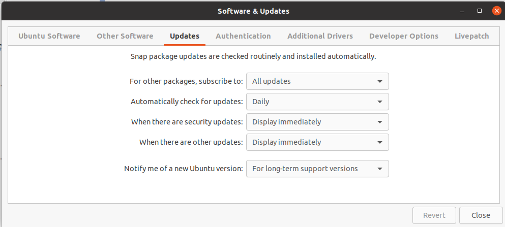
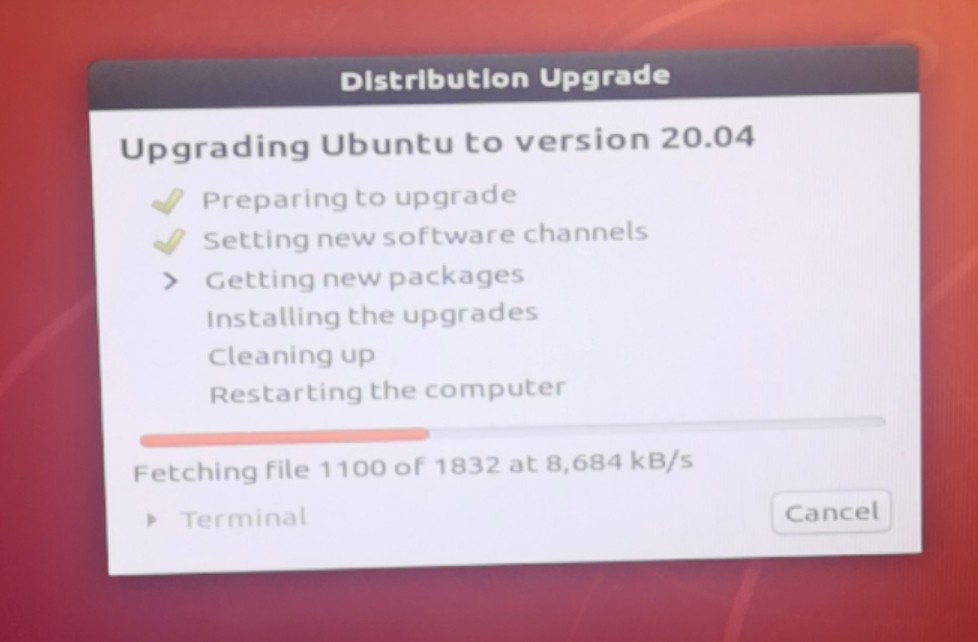

# 更新到ubuntu20.04

1. 打开Software & Updates，选择【updates】，在【notify me of a new ubuntu version】，选择【For long-term support versions】.

   

2. 按Alt + F2并在命令框中键入 sudo update-manager -c -d  并回车，就会进入安装管理器页面，提示你 “Ubuntu 20.04 LTS现在可用”

   