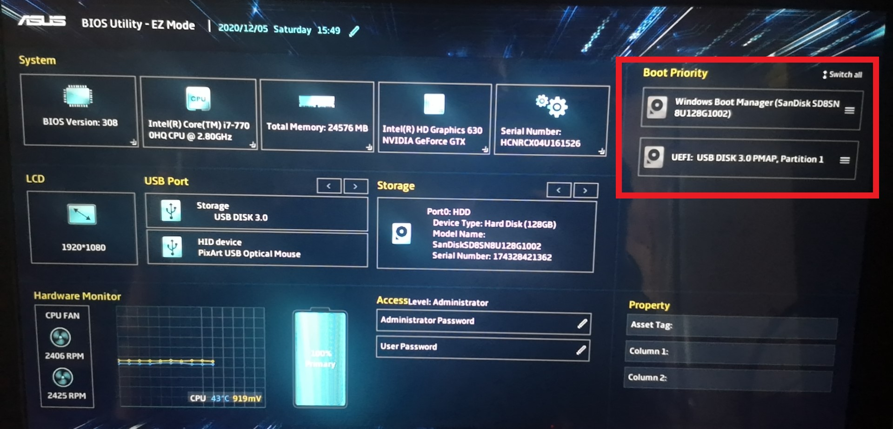
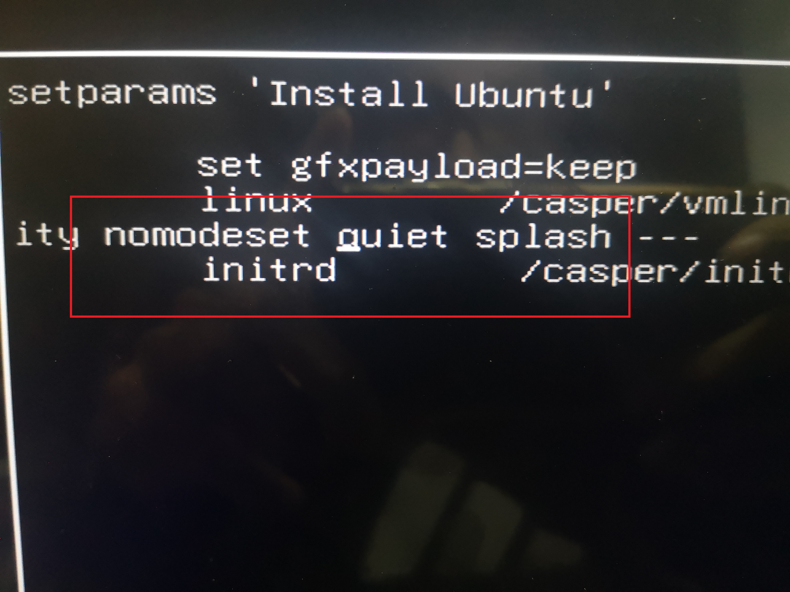

# 安装win10 + ubuntu双系统
准备好一个正常启动的4G以上u盘，和一个正常启动的windows电脑
1. 在windows下，下载rufus和ubuntu\*.iso文件（不要直接使用20.04）
2. 制作u盘启动盘

+ 【设备】选择u盘（u盘会被格式化，最好用4G或者8G）

+ 【引导类型选择】选择下载好的ubuntu*.iso

+ 【分区类似】一般MBR，适合BIOS和UEFI安装

+ 【卷标】是格式化之后的u盘名称

+ 【文件系统】选择默认的FAT32，此文件格式适合4G以下的文件，且最大只支持4G

+ 【簇大小】选择默认，表示最小单位文件大小

  选择开始，之后耐心等待6-10分钟，直到显示"绿色的准备就绪"，点击关闭
  期间可能需要联网，自动下载syslinux，选择是，并选择以iso镜像模式写入，选则是


3. 硬盘分区
在想要分区的硬盘上压缩卷，最好超过50GB，我装在了机械硬盘上，选择了200GB，即204800MB
**！！注意不要新建卷，保持空白就好，即显示是黑条**
分区结束后，关机

4. 开机，选择以U盘启动（U盘需一直插着）
+ 方法1  快捷键启动，以华硕系列为例，开机快速按ESC，即可进入快捷界面，选择刚制作的启动盘启动(UEFI)

+ 方法2 进入BIOS，以华硕系列为例，开机快速按F2，把右侧u盘移到至首位（下图为移动）

！！ 注意两种方法都要禁用FAST boot，即disabled，f7配置，f10保存退出


出现以下界面的原因：
使用ubuntu20.04镜像


5. 禁用显卡（如果有显卡的话，我是GTX 1050显卡）
+ 选择第二个install ubuntu，按e进入

+ 在quiet前面加入nomodeset，按f10 ，开始安装


6. 安装
仅给出几张关键的图
+ 默认字体（可以选择简体中文）

+ 安装选项（选择最下面的）

+ 安装位置（默认第一个）


7. 进入高级模式安装显卡
+ 安装结束后重启，进入高级选项

+ 进入recovery mode

+ 选择resume，第一个


+换源
找到softwore&updates ，Downloads from选择other，找到china下的清华源,close

```shell
sudo apt update
sudo ubuntu-drivers autoinstall
```


**注意可能会内核更新，要等内核更新完毕才能安装显卡，否则会出现dpkg锁住** 